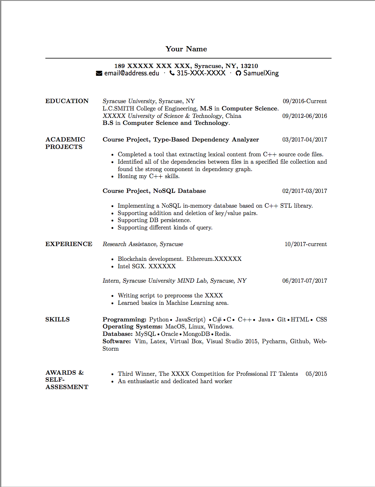

# ResumeTemplate

A LaTex resume template.

## How to use.

- Clone or download this project.
- Open and compile the tex file with TeXShop or other LaTex editor.

## Template

## License

[The MIT License (MIT)](http://opensource.org/licenses/MIT)